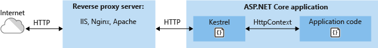
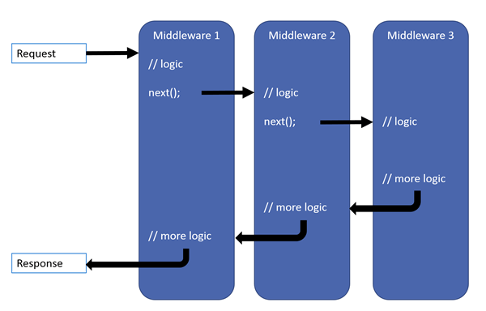
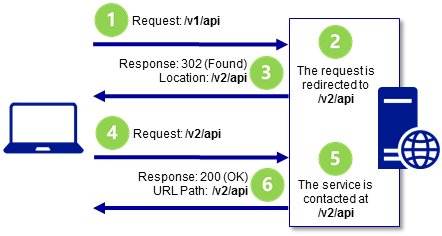

# Asp.Net Core Interview Questions And Answers

Here's a set of essential ASP.NET Core interview questions across .NET Core Basics, ASP.NET Core MVC, and Authentication & Authorization that can serve as an effective guide for preparing for interviews, revising key concepts, and strengthening your technical skills.


### Table of Contents

| No. | Questions |
|---- | ---------
|1 | [What is .NET Core?](#what-is-net-core)|
|2 | [What are the differences between .NET Core and .NET Framework?](#what-are-the-difference-between-netcore-and-net-framework)|
|3 | [What is ASP.NET Core?](#what-is-aspnet-core)|
|4 | [What are the features provided by ASP.NET Core?](#what-are-the-features-provided-by-aspnet-core)|
|5 | [Describe the Servers in ASP.NET Core](#describe-the-servers-in-aspnet-core)|
|6 | [What is Kestrel?](#what-is-kestrel)|
|7 | [What is WebListener?](#what-is-weblistener)|
|8 | [What is ASP.NET Core Module (ANCM)?](#what-is-aspnet-core-module-ancm)|
|9 | [What is the startup class in ASP.NET core?](#what-is-the-startup-class-in-aspnet-core)|
|10 | [What is a Host and what’s the importance of Host in ASP.NET Core application?](#what-is-a-host-and-what's-the-importance-of-host-in-aspnet-core-application)|
|11 | [What does WebHost.CreateDefaultBuilder() do?](#what-does-webhost-createdefaultbuilder-do)|
|12 | [What is the role of Startup class?](#what-is-the-role-of-startup-class)|
|13 | [What is the role of ConfigureServices and Configure method?](#what-is-the-role-of-configureServices-and-configure-method)|
|14 | [Where to keep configuration information in ASP.NET Core.](#where-to-keep-configuration-information-in-aspnet-core)|
|15 | [What is the role of IHostingEnvironment interface in ASP.NET Core?](#what-is-the-role-of-ihostingenvironment-interface-in-aspnet-core)|
|16 | [What is middleware?](#what-is-middleware)|
|17 | [Describe the URL Rewriting Middleware in ASP.NET Core](#describe-the-url-rewriting-middleware-in-aspnet-core)|
|18 | [What is Request delegate?](#what-is-request-delegate)|
|19 | [What is the difference between IApplicationBuilder.Use() and IApplicationBuilder.Run()?](#what-is-the-difference-between-iapplicationbuilder-use-and-iapplicationbuilder-run)|
|20 | [What is the use of the “Map” extension while adding middleware to the ASP.NET Core pipeline?](#what-is-the-use-of-the-map-extension-while-adding-middleware-to-the-aspnet-core-pipeline)|


1. ### What is .NET Core?

.NET Core is a newer version of .NET, which is cross-platform, supporting Windows, MacOS, and Linux, and can be used in device, cloud, and embedded/IoT scenarios.

The following characteristics best define .NET Core:

**Flexible deployment**: Can be included in your app or installed side-by-side user or machine-wide.

**Cross-platform**: Runs on Windows, MacOS, and Linux; can be ported to other OSes. The supported Operating Systems (OS), CPUs, and application scenarios will grow over time, provided by Microsoft, other companies, and individuals.

**Command-line tools**: All product scenarios can be exercised at the command line.

**Compatible**: .NET Core is compatible with .NET Framework, Xamarin, and Mono, via the .NET Standard Library.

  **[⬆ Back to Top](#table-of-contents)**


2. ### What are the differences between .NET Core and .NET Framework?
   

    | .NET Core  | .NET Framework |
    |---- | ---------
    | Completely open-source. | Few components are open-source. |
    | Compatible with Linux, Windows, and Mac operating systems.  | Compatible with only Windows. |
    | Does not support desktop application development.  | Supports web and desktop application development. |
    | Supports microservices development.  | Does not support microservices development. |
    | Lightweight for Command Line Interface(CLI).  | Heavy for Command Line Interface. |
    

  **[⬆ Back to Top](#table-of-contents)**


3. ### What is ASP.NET Core?

ASP.NET Core is an open-source, cross-platform and high-performance platform that allows you to build modern, Internet-connected and cloud-enabled applications. It is much faster, configurable, modular, scalable, extensible, and has cross-platform support. It can work with both .NET Core and .Net frameworks via the .NET standard framework. It is best suited for developing cloud-based web applications, mobile applications, and IoT applications.

With ASP.NET Core you can

Build web applications, IoT (Internet of things) apps, services and mobile Backends.
Run on .Net Core.
You can do your development on Linux, Windows and MacOS.
Deploy your code to cloud or on-premises.

  **[⬆ Back to Top](#table-of-contents)**

4. ### What are the features provided by ASP.NET Core?

Following are the core features that are provided by the ASP.NET Core

- Built-in supports for Dependency Injection
- Built-in supports for the logging framework and it can be extensible
- Introduced a new, fast and cross-platform web server – Kestrel. So, a web application can run without IIS, Apache, and Nginx.
- Multiple hosting ways are supported
- It supports modularity, so the developer needs to include the module required by the application. However, the .NET Core framework is also providing the meta package that includes the libraries
- Command-line supports to creating, building, and running of the application
- There is no web.config file. We can store the custom configuration into an appsettings.json file
- There is no Global.asax file. We can now register and use the services in the startup class
- It has good support for asynchronous programming
- Support WebSocket and SignalR
- Provide protection against CSRF (Cross-Site Request Forgery)


  **[⬆ Back to Top](#table-of-contents)**

5. ### Describe the Servers in ASP.NET Core

Server is required to run any application. ASP.NET Core provides an in-process HTTP server implementation to run the app. This server implementation listen for HTTP requests and surface them to the application as a set of request features composed into an HttpContext.
ASP.NET Core use the Kestrel web server by default. ASP.NET Core comes with:

Default Kestrel web server that’s cross platform HTTP server implementation.
IIS HTTP Server that’s in-process server for IIS.
HTTP.sys server that’s a Windows-only HTTP server and it’s based on the HTTP.sys kernel driver and HTTP Server API.

  **[⬆ Back to Top](#table-of-contents)**

6. ### What is Kestrel?

Kestrel is an event-driven, I/O-based, open-source, cross-platform, and asynchronous server which hosts .NET applications. It is provided as a default server for .NET Core therefore, it is compatible with all the platforms and their versions which .NET Core supports.


 

It is really fast, secure and good enough to use it without a reverse proxy server. However, it is still recommended that you use IIS, Nginx or Apache or something else.

Kestrel is the default web server in .NET Core. But still it can use IIS, Apache, Nginx etc.
Usually, it is used as an edge-server, which means it is the server which faces the internet and handles HTTP web requests from clients directly. It is a listening server with a command-line interface. 

Advantages of Kestrel are: 

- Lightweight and fast. 
- Cross-platform and supports all versions of .NET Core. 
- Supports HTTPS 
- Easy configuration
 
 **[⬆ Back to Top](#table-of-contents)**

7. ### What is WebListener?

ASP.NET Core ships two server implementations Kestral and WebListener. ```WebListener``` is also a web server for ASP.NET Core that runs only on Windows. It’s built on the ```Http.Sys``` kernel mode driver. WebListener is an alternative to Kestrel that can be used for direct connection to the Internet without relying on IIS as a reverse proxy server.

 **[⬆ Back to Top](#table-of-contents)**

8. ### What is ASP.NET Core Module (ANCM)?

ASP.NET Core Module (ANCM) lets you run ASP.NET Core applications behind IIS and it works only with Kestrel. it isn’t compatible with WebListener. ANCM is a native IIS module that hooks into the IIS pipeline and redirects traffic to the backend ASP.NET Core application. ASP.NET Core applications run in a process separate from the IIS worker process, ANCM also does process management.

ANCM starts the process for the ASP.NET Core application when the first request comes in and restarts it when it crashes. In short, it sits in IIS and routes the request for ASP.NET Core application to Kestral.

 **[⬆ Back to Top](#table-of-contents)**

9. ### What is the startup class in ASP.NET core?

The startup class is the entry point of the ASP.NET Core application. Every .NET Core application must have this class. This class contains the application configuration-related items. It is not necessary that the class name must be “Startup”, it can be anything, we can configure the startup class in the Program class.

```C#
public class Program
 {
 public static void Main(string[] args)
 {
 CreateWebHostBuilder(args).Build().Run();
 }
 
 public static IWebHostBuilder CreateWebHostBuilder(string[] args) =>
 WebHost.CreateDefaultBuilder(args)
 .UseStartup<TestClass>();
 }
```

 **[⬆ Back to Top](#table-of-contents)**
  
10. ### What is a Host and what’s the importance of Host in ASP.NET Core application?

ASP.NET Core apps require a host in which to execute. The host is responsible for application startup and lifetime management. Other responsibility of host’s includes ensuring the application’s services and the server is available and properly configured. The host is responsible for starting the app and its management, whereas the server is responsible for accepting HTTP requests. 

The host is configured to use a particular server; the server is unaware of its host. The host is typically created using an instance of a ```WebHostBuilder```, which builds and returns a ```WebHost``` instance. The WebHost references the server that will handle requests.

 **[⬆ Back to Top](#table-of-contents)**

11. ### What does WebHost.CreateDefaultBuilder() do?

```WebHost.CreateDefaultBuilder()``` configure the app to use Kestrel as web server. It Specify to use the current project directory as root directory for the application. Set up the configuration sub-system to read setting from appsettings.json and appsettings.{env}.json to environment specific configuration.

Configure logging to read from the Logging section of the appsettings.json file and log to the Console and Debug window. It can configure integration with IIS

  **[⬆ Back to Top](#table-of-contents)**

12. ### What is the role of Startup class?

Startup class is responsible for configuration related things as below.

- It configures the services which are required by the app.
- It defines the app’s request handling pipeline as a series of middleware components.
- Startup class is specified inside the CreateHostBuilder method when the host is created.
- Multiple Startup classes can also be defined for different environments, At run time appropriate startup classes are used.

```c#
// Startup class example
public class Startup 
{
    public Startup(IConfiguration configuration)
    {
        Configuration = configuration;
    }

    public IConfiguration Configuration { get; }

    public void ConfigureServices(IServiceCollection services)
    {
        services.AddRazorPages();
    }

    public void Configure(IApplicationBuilder app, IWebHostEnvironment env)
    {
        if (env.IsDevelopment())
        {
            app.UseDeveloperExceptionPage();
        }
        else
        {
            app.UseExceptionHandler("/Error");
            app.UseHsts();
        }

        app.UseHttpsRedirection();
        // other middleware components
    }
}
```

  **[⬆ Back to Top](#table-of-contents)**


13. ### What is the role of ConfigureServices and Configure method?

ConfigureServices method is optional and defined inside startup class as mentioned in above code. It gets called by the host before the ‘Configure’ method to configure the app’s services. The Configure method is used to specify how the ASP.NET application will respond to HTTP requests. The request pipeline is configured by adding middleware components to an ```IApplicationBuilder``` instance that is provided by dependency injection. There are some built-in middlewares for error handling, authentication, routing, session and diagnostic purpose. Highlighted lines in below code, are built-in Middleware with ASP.NET Core 1.0.

You can configure the services and middleware components without the Startup class and it’s methods, by defining this configuration inside the Program class in ```CreateHostBuilder``` method.

 **[⬆ Back to Top](#table-of-contents)**

14. ### Where to keep configuration information in ASP.NET Core.

In ASP.NET Core ```web.config``` is not available. So here we have to store configuration information in ```appsetting.json``` file, which is a plain text file, it keeps information as key-value pair in JSON format.

```json
{
  "Logging": {
    "IncludeScopes": false,
    "LogLevel": {
      "Default": "Warning"
    }
  },
  "Data": {
    "ConnectionString": "Data Source=KIITs\\SQLEXPRESS;Initial Catalog=testdb;Integrated Security=True"
  }
}
```

 **[⬆ Back to Top](#table-of-contents)**

15. ### What is the role of IHostingEnvironment interface in ASP.NET Core?

ASP.NET Core offers an interface named ```IHostingEnvironment```, allows you to programmatically retrieve the current environment so you can have an environment-specific behavior. By default, ASP.NET Core has 3 environments Development, Staging, and Production. Previously, the developers had to build the application differently for each environment (Staging, UAT, Production) due to dependency on config file sections and the preprocessor directive applicable at compile time. ASP.NET Core takes a different approach and uses ```IHostingEnvironment``` to retrieve the current environment. 

 **[⬆ Back to Top](#table-of-contents)**

16. ### What is middleware?

It is software that is injected into the application pipeline to handle requests and responses. They are just like chained to each other and form as a pipeline. The incoming requests are passed through this pipeline where all middleware is configured, and middleware can perform some action on the request before passing it to the next middleware. Same as for the responses, they are also passing through the middleware but in reverse order.



The Request handling pipeline is a sequence of middleware components where each component performs the operation on request and either call the next middleware component or terminates the request. When a middleware component terminates the request, it’s called Terminal Middleware as It prevents next middleware from processing the request. You can add a middleware component to the pipeline by calling .Use… extension method as below.

```c#
app.UseHttpsRedirection();
app.UseStaticFiles();
app.UseRouting();
```

In ASP.NET Core, middleware components are executed in the order they are added to the pipeline. The order is critical because each middleware component can control the flow of requests and responses

Here’s the common middleware order for a typical ASP.NET Core app:


 **[⬆ Back to Top](#table-of-contents)**

17. ### Describe the URL Rewriting Middleware in ASP.NET Core.

URL rewriting is the act of modifying request URLs based on one or more predefined rules. URL rewriting creates an abstraction between resource locations and their addresses so that the locations and addresses aren’t tightly linked



URL rewriting is valuable in several scenarios to:

- Move or replace server resources temporarily or permanently and maintain stable locators for those resources.
- Split request processing across different apps or across areas of one app.
- Remove, add, or reorganize URL segments on incoming requests.
- Optimize public URLs for Search Engine Optimization (SEO).
- Permit the use of friendly public URLs to help visitors predict the content returned by requesting a resource.
- Redirect insecure requests to secure endpoints.
- Prevent hotlinking, where an external site uses a hosted static asset on another site by linking the asset into its own content.

 **[⬆ Back to Top](#table-of-contents)**

18. ### What is Request delegate?

Request delegates handle each HTTP request and are used to build request pipeline. It can configured using Run, Map and Use extension methods. An request delegate can be a in-line as an anonymous method (called in-line middleware) or a reusable class. These classes or in-line methods are called middleware components.

 **[⬆ Back to Top](#table-of-contents)**

19. ### What is the difference between IApplicationBuilder.Use() and IApplicationBuilder.Run()?

We can use both the methods in Configure methods of the startup class. Both are used to add middleware delegates to the application request pipeline. The middleware adds using ```IApplicationBuilder.Use``` may call the next middleware in the pipeline whereas the middleware adds using ```IApplicationBuilder```.The run method never calls the subsequent middleware. After IApplicationBuilder.Run method, The system stops adding middleware in the request pipeline.

 **[⬆ Back to Top](#table-of-contents)**

20. ### What is the use of the “Map” extension while adding middleware to the ASP.NET Core pipeline?

It is used for branching the pipeline. It branches the ASP.NET Core pipeline based on request path matching. If the request path starts with the given path, middleware on that branch will execute.

```
public void Configure(IApplicationBuilder app)
 {
 app.Map("/path1", Middleware1);
 app.Map("/path2", Middleware2);
 }
```


